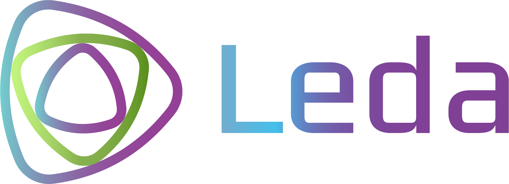

# Eclipse Leda Documentation

This repository contains the sources of the main user documentation of the [Eclipse Leda](https://github.com/eclipse-leda/) project.

The rendered documentation is available at https://eclipse-leda.github.io/leda/

## Introduction

The Eclipse Leda project provides system image "recipes" to deliver a functional and always-available Linux-based image/distribution in the context of SDV (Software Defined Vehicle), by pulling together individual contributor pieces from [Eclipse SDV](https://sdv.eclipse.org/) and the larger OSS community.

The quickstart images help to learn how the SDV development, test and deployment lifecycle works from an E2E perspective, including the deployment of applications into the container runtimes on constrained embedded devices.

The ready images are also useful for quickly setting up showcases with virtual or real hardware devices.

Eclipse Leda provides a Poky-based reference build pipeline and an OpenEmbedded Metalayer [meta-leda](https://github.com/eclipse-leda/meta-leda) for integration into existing Yocto-based projects.

## Building the documentation

Pre-Requisites:
- Hugo 0.96.0 (preinstalled in DevContainer, otherwise see https://gohugo.io/getting-started/installing/)
- Theme "docsy" (https://www.docsy.dev/): `git clone https://github.com/google/docsy.git themes/docsy && (cd themes/docsy; npm i)`
- Docsy Dependencies: `npm i -g postcss postcss-cli autoprefixer`

Building the documentation (in devcontainer):
- Run hugo: `hugo server`
- Open browser at http://localhost:1313/

## Installing Pre-Requisuites

## Graphic Conversions

See https://www.docsy.dev/docs/adding-content/iconsimages/

- Inkspace for logo conversion: `apt-get install inkscape`
- `inkscape --export-plain-svg assets/icons/logo.svg assets/logo/logo_02_cmyk.eps`

# Contributing

If you want to contribute bug reports or feature requests, please use *GitHub Issues*.

# License and Copyright

This program and the accompanying materials are made available under the
terms of the Apache License 2.0 which is available at
https://www.apache.org/licenses/LICENSE-2.0

For details, please see our license [LICENSE](LICENSE)
