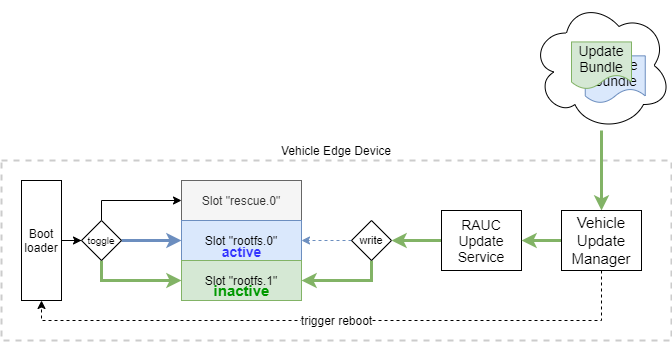

In general, the self-update mechanism for operating system level updates is done with two separate partitions. While one partition is the actively booted partition and in use, the other partition can be updated by writing a partition image to it, as it is unused or inactive.

Once the download and writing is done, a reboot is triggered and the boot loader will now switch to the newly updated partition.

If the booting of the updated partition fails, the self update mechanism can revert back to the previous partition or boot to a rescue partition.

As updating the running operating system cannot be done at runtime, the approach requires additional disk space, a second partition and also requires the device to be rebooted for the updates to take effect.

In a vehicle, the self-updater cannot decide on its own when to do a reboot, as the vehicle must be in a safe condition (eg parked, state of charge etc.). Hence, the trigger for performaing the switch to another slot and a subsequent reboot is handed over to a higher level component, such as the vehicle update manager, which may in turn rely on driver feedback or other conditions.

# Implementation with RAUC Update Service

[RAUC](https://www.rauc.io/) is a lightweight update client that runs on your embedded device and reliably controls the procedure of updating your device with a new firmware revision.

For general usage of the RAUC tool, please see the [RAUC User manual](https://rauc.readthedocs.io/en/latest/using.html)

## Reference configuration

The project contains an example reference implementation and configuration using RAUC, which allows the evaluation of the concepts, mechanisms and involved software components in an emulated, virtual environment.

The Leda quickstart image contains the following disk partitions:
- a small rescue partition
- a full SDV installation with a Kubernetes Control Plane (Server + Agent as single node), pre-loaded SDV container images and deployment specifications and additional developer tools such as nerdctl and k9s.
- a minimal SDV installation with a Kubernetes Control Plane (Server + Agent as single node), but no additional examples or developer tools. This partition is used to demonstrate the self-update functionality.
- additional boot and data partitions for keeping system state information

*Note: All three rootfs partitions (rootfs) initially contain the same identical copies of the base operating system. Both SDV Root partitions which contain the Kubernetes Control Plane will use the same shared data partition for the Kubernetes Cluster information. *

